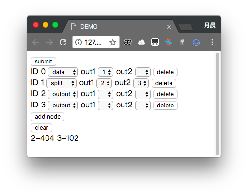

# k12ml
create ml model by using dag

# 运行环境  >Python 3.4(推荐python3.6)
pip install --upgrade pip
pip install django
pip install numpy
pip install scipy
pip install matplotlib
pip install sklearn

# 下载运行
git pull origin master
git clone https://github.com/xfangfang/k12ml.git
cd k12ml
python manage.py migrate
python manage.py runserver 0.0.0.0:8000

# 更新
cd k12ml
git pull origin master

